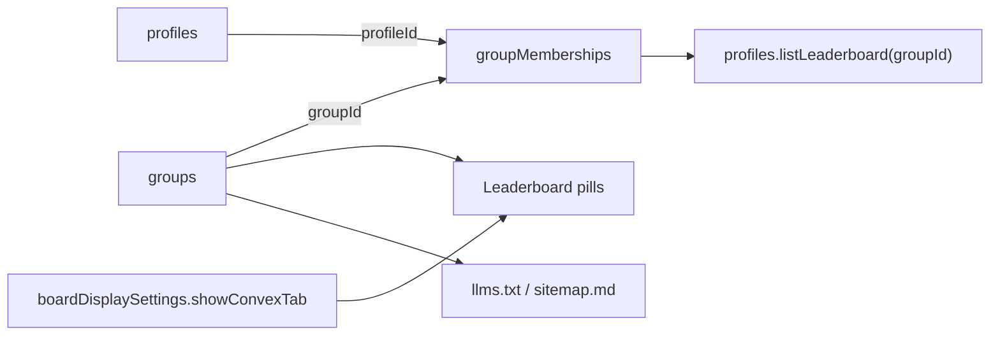

# Custom groups, fork toggle, site branding, and X list import

## What exists today

- Two hardcoded pills in [src/components/Leaderboard.tsx](src/components/Leaderboard.tsx) (lines ~541 to 565): "Yappers" and "Convex mentions". Both are sort modes over the same active profiles.
- No group concept in [convex/schema.ts](convex/schema.ts). Board display settings live in the `boardDisplaySettings` singleton via [convex/boardSettings.ts](convex/boardSettings.ts).
- X list import already works in [convex/imports.ts](convex/imports.ts) (`previewXList` calls `GET /2/lists/{id}/members` with `X_BEARER_TOKEN`, max 100 members). We reuse this for group auto-import.
- `llms.txt` and `sitemap.md` are generated live by [convex/siteDirectory.ts](convex/siteDirectory.ts) and [convex/siteFiles.ts](convex/siteFiles.ts).

Assumption, flagged: "hide the convex yappers tab" means the **Convex mentions** pill. The plain "Yappers" pill stays as the default board (a fork keeps that and can retitle the site).

## Data model

New tables in [convex/schema.ts](convex/schema.ts):

- `groups`: `name`, `slug`, `description` (optional), `visible` (boolean, controls public pill), `order` (number), `xListId` (optional string), `createdAt`, `updatedAt`. Indexes: `by_slug`, `by_order`.
- `groupMemberships`: `groupId`, `profileId`, `addedAt`. Indexes: `by_group_and_profile`, `by_profile_id`, `by_group_and_added_at`. Many-to-many so one person can sit in several groups (Convex team member who is also a speaker).

Extend `boardDisplaySettings` with `showConvexTab: v.optional(v.boolean())` (optional keeps existing docs valid, missing means true, so nothing breaks on deploy).

## Backend

New [convex/groups.ts](convex/groups.ts):

- `listPublic` query: visible groups with active member counts (pills only render for groups with at least one active member).
- `listAdmin` query, plus `create`, `update` (rename, description, visibility, order, xListId), `remove` (deletes memberships too), `addMembers` (by profile ids or handles), `removeMember`. All admin mutations behind `requireAdmin`.
- `syncFromXList` action: resolves the group's `xListId`, reuses the import helpers from [convex/imports.ts](convex/imports.ts) to fetch members, creates any missing profiles (source `x-list`, approved and active, then rescanned by the normal sync), and upserts memberships. Idempotent, safe to run repeatedly. Manual button first; no cron in this pass (X list member reads are rate limited to 75 requests per 15 min, so on-demand is the safe default).

Changes to existing files:

- [convex/profiles.ts](convex/profiles.ts): `listLeaderboard` gains optional `groupId`. When set, read memberships via `by_group_and_added_at`, load profiles, keep `active === true`, sort with the existing yappers comparator. `remove` also deletes that profile's memberships.
- [convex/boardSettings.ts](convex/boardSettings.ts): `getBoardDisplay` and `setBoardDisplay` carry `showConvexTab` (default true).
- [convex/siteFiles.ts](convex/siteFiles.ts) and [convex/siteDirectory.ts](convex/siteDirectory.ts): `listPublicDirectory` also returns visible groups with member handles. `buildLlmsTxt` and `buildSitemapMd` add a "## Groups" section (name, description, member list). `buildSitemapXml` adds `/?board=slug` URLs. If no groups exist, output is unchanged.

## Frontend

[src/components/Leaderboard.tsx](src/components/Leaderboard.tsx):

- Board state becomes `"impressions" | "convex" | group slug`, synced to a `?board=` URL param so pills are linkable and sitemap URLs resolve.
- Pills render dynamically: Yappers always, Convex mentions only when `showConvexTab` is true, then one pill per visible group (ordered by `order`). The current fixed 2-column `mode-tabs` grid in [src/globals.css](src/globals.css) (~1794) becomes flexible for N pills; the sliding thumb math updates or falls back to a simpler active style, with horizontal scroll on small screens.
- Group view reuses the yappers table, columns, search, top filter, and expanded rows; the convex-mentions columns stay tied to the convex pill.

Admin:

- New route `/admin/groups` in [src/App.tsx](src/App.tsx), page [src/pages/AdminGroupsPage.tsx](src/pages/AdminGroupsPage.tsx), component [src/components/GroupsPanel.tsx](src/components/GroupsPanel.tsx): create, rename, describe, show or hide, reorder, delete groups; per group member management (search existing profiles, add by handle, remove); paste an X list URL and "Import from list" with a preview count. Follows existing admin styles, no browser-default dialogs.
- [src/components/AdminPanel.tsx](src/components/AdminPanel.tsx): `BoardSettings` gains a "Show Convex mentions tab" toggle and a link card to Manage groups.

## Site branding settings (fork in one pass)

Goal: change the site title, community name, and logo once in admin and have it flow everywhere. Every field defaults to what is in prod today, so an untouched deploy renders byte-identical.

Where "Friends of Convex" branding lives today (found by audit):

- [src/components/SiteHeader.tsx](src/components/SiteHeader.tsx) lines 18 to 27: Convex wordmark SVG (`/brand/convex-logo-white.svg`), the F/CVX chip, and the "Friends who yap" / "Yapper board" titles.
- [src/components/Leaderboard.tsx](src/components/Leaderboard.tsx) lines 382 to 500: page heading, eyebrow ("Friends of Convex · people edition"), and share text.
- [src/lib/usePageTitle.ts](src/lib/usePageTitle.ts): document title base "Friends of Convex Yapper Board".
- [src/components/JoinBoard.tsx](src/components/JoinBoard.tsx): join page copy.
- [convex/siteDirectory.ts](convex/siteDirectory.ts): llms.txt, sitemap.md, and robots.txt headers and descriptions.
- Static, cannot be runtime settings: [index.html](index.html) title, OG and JSON-LD meta, favicon and OG image in [public/](public). README documents these as the one manual edit for a fork.
- Long-form prose ([src/pages/AboutPage.tsx](src/pages/AboutPage.tsx), gift portal copy) stays hardcoded; README tells forks to rewrite the About page directly.

Backend, new [convex/siteSettings.ts](convex/siteSettings.ts):

- `siteSettings` singleton table in [convex/schema.ts](convex/schema.ts) (key `"site"`), all fields optional strings: `siteTitle`, `siteDescription`, `communityName`, `boardName`, `eyebrowText`, `headerTitle`, `logoStorageId` (`v.optional(v.id("_storage"))`), plus `updatedAt`.
- Defaults live in one shared constants object (current prod strings). `getSiteBranding` (public query) merges saved values over defaults and resolves the logo URL from storage; `setSiteBranding` and `resetSiteBranding` behind `requireAdmin`. Logo upload reuses the `generateBadgeUploadUrl` pattern from [convex/badges.ts](convex/badges.ts).

Admin UI:

- New route `/admin/settings`, page [src/pages/AdminSettingsPage.tsx](src/pages/AdminSettingsPage.tsx), component [src/components/SiteSettingsPanel.tsx](src/components/SiteSettingsPanel.tsx): text fields with live preview of the header lockup, logo upload with fallback to the current Convex wordmark, and a "Reset to defaults" button (site design system confirm, not browser confirm).
- Admin nav in [src/components/SiteHeader.tsx](src/components/SiteHeader.tsx) gets a Settings link with the Phosphor `GearSixIcon` (`@phosphor-icons/react` is already used by Leaderboard).

Frontend wiring: `SiteHeader`, `Leaderboard` heading and share text, `usePageTitle`, and `JoinBoard` read `api.siteSettings.getSiteBranding` and fall back to defaults while loading, so there is no flash of missing branding. [convex/siteFiles.ts](convex/siteFiles.ts) passes branding into the [convex/siteDirectory.ts](convex/siteDirectory.ts) builders.

## Docs and tracking

- README plus [docs/SETUP_GUIDE.md](docs/SETUP_GUIDE.md): new "Groups" section (create, rename, visibility, X list import) and a "Fork this board" section with three tiers:
  1. Rebrand from admin: `/admin/settings` changes title, community name, board name, and logo in one pass.
  2. Hide Convex features: turn off the Convex mentions pill in admin board settings.
  3. Remove Convex entirely: exact file list for the leftovers ([index.html](index.html) meta and OG tags, [public/](public) favicon and OG image, [src/pages/AboutPage.tsx](src/pages/AboutPage.tsx) prose, gift portal copy, [convex/xSyncParsing.ts](convex/xSyncParsing.ts) mention scan and convex columns, Slack digest).
- PRD at `prds/custom-groups-and-fork-toggle.md` with UTC timestamps; update `task.md`, `changelog.md` (real dates from git log), `files.md`.
- Tests: extend [tests/xSyncParsing.test.ts](tests/xSyncParsing.test.ts) style with a small vitest suite for the group leaderboard sort helper and the llms.txt groups section.

## Ideas included because they make sense, no breakage

- `?board=` URL param: shareable links to any pill, needed for sitemap anyway.
- Pills hide themselves when a group is empty or hidden, so the public UI never shows a dead tab.
- Deleting a profile cleans memberships, so no orphaned rows.
- Branding defaults merged server-side in one query, so a fork that never opens settings ships the exact prod look and an admin edit updates header, board, page title, share text, and llms.txt together.
- The Yappers pill label becomes brandable via `boardName`, which covers the "retitle the site" case from the earlier assumption.
- Deferred on purpose (can add later): scheduled list re-sync cron, per-group column settings, group-specific Slack digests, accent color theming, runtime OG meta (needs SSR or an edge rewrite, not worth it now).

## Verification

- Fresh deploy with no groups and untouched settings: board, header, and discovery files byte-identical in behavior.
- Toggle Convex tab off: pill disappears, direct `?board=convex` falls back to Yappers.
- Create group, import from an X list, confirm pill, counts, llms.txt and sitemap.md sections.
- Change community name and logo in `/admin/settings`: header, board heading, document title, share text, and llms.txt all update; reset restores prod defaults.
- `npx vitest run` and `npx tsc --noEmit` clean.
