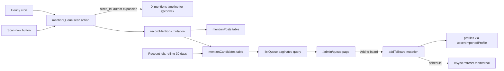

# @convex mention queue

## How it works

The X API mentions timeline (`GET /2/users/:id/mentions`) returns posts that mention one account. It works with the app-only `X_BEARER_TOKEN` we already use, can be expanded to include author profiles (`expansions=author_id`), and covers the 800 most recent mentions. An hourly cron calls it with `since_id`, so each run reads only new posts. That keeps X pay-per-use costs low, and our stored history builds up past the 800 cap over time.

## Data model ([convex/schema.ts](convex/schema.ts))

- `mentionPosts`: `postId`, `authorXUserId`, `text` (trimmed to 200 characters), `url`, `postedAt`. Indexes are `by_post_id` (for dedupe) and `by_author_x_user_id_and_posted_at` (for each person's last two posts and their 30 day count).
- `mentionCandidates`: one row per author, holding `xUserId`, `handle`, `normalizedHandle`, `displayName`, `profileImageUrl`, `bio`, `followerCount`, `recentMentionCount` (last 30 days), `lastMentionAt`, `status`, `reviewedAt`, and `updatedAt`. Indexes are `by_x_user_id` and `by_status_and_last_mention_at`.
  - `status` is one of `watching` (fewer than 2 mentions), `queued` (2 or more), `added`, or `dismissed`. Because only qualified people get `queued`, the queue is a single indexed, paginated read sorted by date, with no `.filter()`.
- `mentionScanState` singleton (key `"convex"`): `targetHandle`, `targetXUserId` (looked up once and cached), `sinceId`, `lastScannedAt`, `lastError`.
- Add `v.literal("mention-queue")` to the profile `source` union in [convex/schema.ts](convex/schema.ts) and [convex/validators.ts](convex/validators.ts). This is additive, so no migration is needed.

## Backend ([convex/mentionQueue.ts](convex/mentionQueue.ts), new)

- `scan` (internal action plus an admin `scanNow` wrapper):
  - Resolve @convex to its X user ID through `/2/users/by/username/convex` and cache it.
  - Page the mentions timeline with `max_results=100`, `since_id`, `start_time` set to now minus 30 days, `tweet.fields=created_at,author_id`, `expansions=author_id`, and `user.fields=description,profile_image_url,public_metrics`.
  - Skip posts the @convex account wrote itself, and stop at the first spend cap error using `isSpendCapError` from [convex/xSyncParsing.ts](convex/xSyncParsing.ts).
  - Reuse the `requestX` and `parseXUser` patterns from [convex/imports.ts](convex/imports.ts). Export them instead of copying them.
- `recordMentions` (internal mutation, called once per page):
  - Insert new posts after a dedupe check on `postId`, then upsert candidates.
  - Recompute each touched author's 30 day count from the index.
  - Set status to `queued` when the count is 2 or more, unless the person is already `added` or `dismissed`.
  - Mark someone `added` right away if a profile already exists for their X user ID.
- `recountWindow` (internal mutation, daily cron): pages through `queued` candidates and moves anyone below 2 mentions back to `watching`. It also deletes `mentionPosts` older than 35 days so the table stays bounded. Calling `Date.now()` is fine here because this is a mutation, not a query.
- `listQueue` (admin query): takes `paginationOptsValidator` and an optional `status` (default `queued`). It reads `by_status_and_last_mention_at` in descending order and, for each row, attaches the last two posts with `.take(2)`. It uses the `requireAdmin` helper from [convex/authz.ts](convex/authz.ts).
- `addToBoard({ candidateId })`: an admin mutation that calls `upsertImportedProfile` from [convex/profiles.ts](convex/profiles.ts) with source `mention-queue`. It patches the candidate to `added`, then schedules a new `internal.xSync.refreshOneInternal` so the person's metrics fill in. Calling it twice has the same result as calling it once.
- `dismiss` / `restore`: admin mutations so one-off promoters don't keep coming back.
- `getScanStatus`: an admin query for the page header, showing last scan time, error, and queue count.
- [convex/xSync.ts](convex/xSync.ts): add `refreshOneInternal`, an internal action wrapping the existing `syncProfile`.
- [convex/crons.ts](convex/crons.ts): add `crons.interval` for the hourly scan and a daily `crons.cron` for the recount, both at off-peak minutes.

## Frontend

- [src/pages/AdminQueuePage.tsx](src/pages/AdminQueuePage.tsx) (new) wrapped in `AdminGate`. Add the route in [src/App.tsx](src/App.tsx) and a "Mention queue" link in [src/components/SiteHeader.tsx](src/components/SiteHeader.tsx) admin nav.
- [src/components/MentionQueuePanel.tsx](src/components/MentionQueuePanel.tsx) (new):
  - Uses `usePaginatedQuery(api.mentionQueue.listQueue, { status }, { initialNumItems: 30 })`. The Load more button calls `loadMore(30)`, and the footer reads "Showing X".
  - The header shows the last scan time, a Scan now button, and Queued / Dismissed / Added tabs.
  - Each row shows the avatar, name, @handle, follower count, a "N mentions in 30 days" pill, and the last mention date. It includes two small "View post" links to x.com, each with a one-line text preview, plus Add to board (with a busy state and success note) and Dismiss.
  - Styling reuses the existing `.admin-list` row patterns and theme tokens in [src/globals.css](src/globals.css). Only small additions are needed, with no radial gradients and no browser dialogs.

## Edge cases

- Someone already on the board, or later added by hand, never shows in the queue. Both the scan and `addToBoard` check `by_x_user_id`.
- Protected or suspended authors are missing from the author expansion. Those posts are skipped.
- The first scan only reaches the 800 most recent mentions, which may cover less than 30 days. The page says so until 30 days of history exist.
- When the spend cap or a missing token blocks scanning, the error goes into `mentionScanState.lastError` and appears on the page. The queue keeps its last data.

## Tests and verification

- `tests/mentionQueue.test.ts` uses convex-test to cover the following:
  - Recording two mentions from one author queues them, and one mention leaves them `watching`.
  - Duplicate `postId`s are ignored.
  - The recount demotes someone whose second mention is older than 30 days.
  - `addToBoard` creates a profile and is idempotent.
  - The queue paginates past 30 rows in date order.
- Then run `npx convex dev --once`, `npx tsc --noEmit`, `npx vitest run`, `npx eslint` on touched files, `npm run build`, and one `scanNow` on dev.

## Docs (/workflow)

- Write `prds/mention-queue.md` first (UTC timestamps).
- Afterward, update `task.md`, `changelog.md` (using dates from `git log --date=short -n 10`), `files.md`, and add a Mention queue section to [src/pages/AdminDocsPage.tsx](src/pages/AdminDocsPage.tsx).

## Convex docs check

The relevant current APIs are paginated queries with `usePaginatedQuery`, `crons.interval` / `crons.cron`, and scheduling internal functions, and the plan uses all three. The AI Gateway and typesafe.ai docs don't apply, because this feature makes no model calls.
